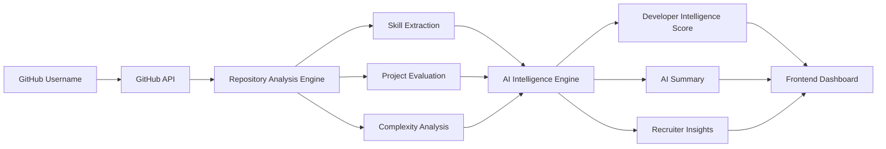
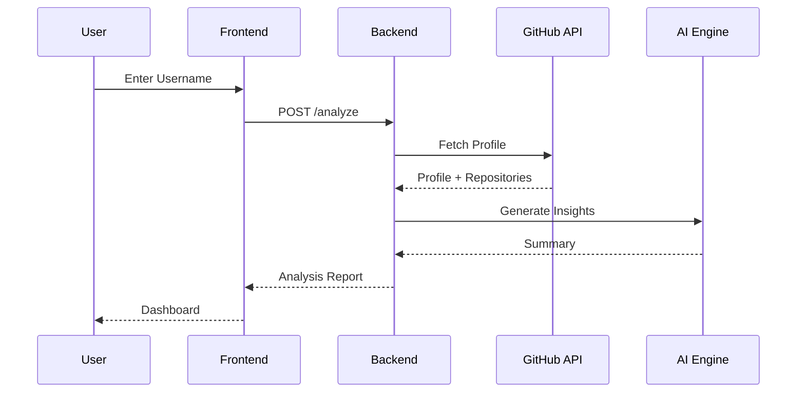
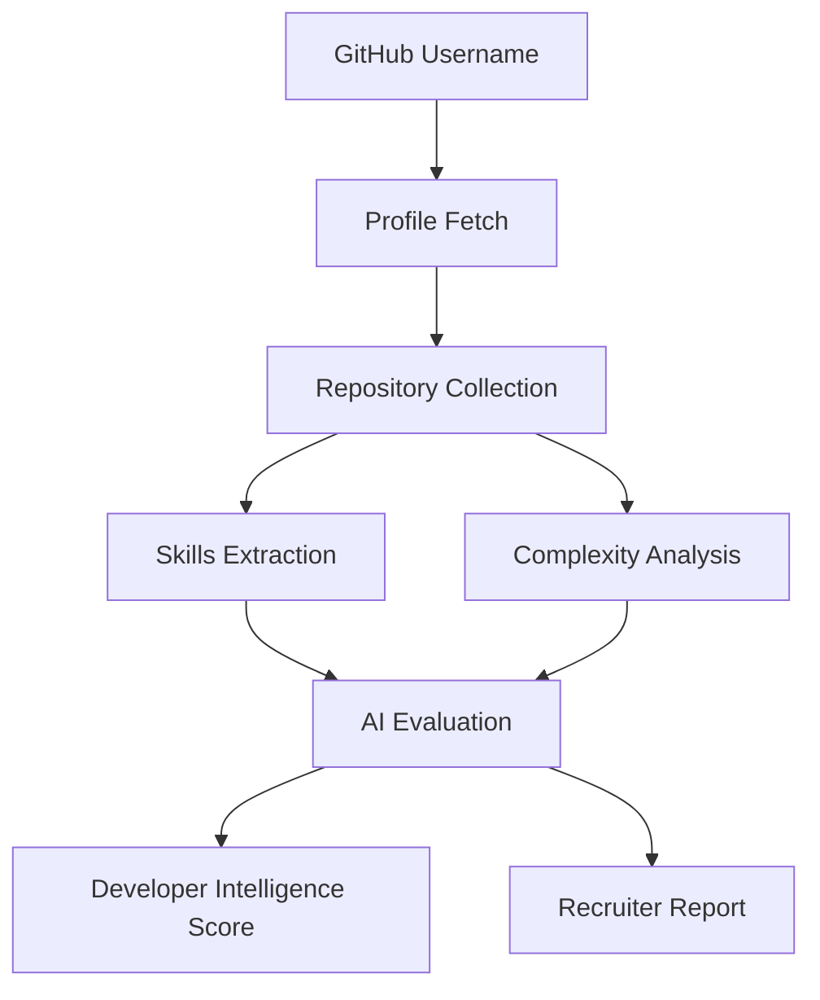

# 🚀 DevPulse AI

<div align="center">

<!-- LOGO PLACEHOLDER -->


# DevPulse AI

### AI-Powered Developer Intelligence Platform

Transform GitHub Profiles into Recruiter-Ready Developer Intelligence Reports


---

**Analyze • Evaluate • Understand • Hire**

[Live Demo](#) • [Documentation](#) • [Report Bug](#) • [Request Feature](#)

</div>

---

# 📖 Overview

DevPulse AI is an AI-powered Developer Intelligence Platform that analyzes GitHub profiles and generates comprehensive developer reports.

Instead of manually reviewing repositories, technologies, commits, and project quality, DevPulse AI automatically evaluates a developer's GitHub presence and provides recruiter-friendly insights within seconds.

The platform combines GitHub data, repository analysis, AI reasoning, and developer evaluation metrics to produce actionable hiring intelligence.

---

# 🎯 Problem Statement

Evaluating developers through GitHub profiles is difficult.

Recruiters and hiring managers often face challenges such as:

* Hundreds of repositories to review
* Inconsistent project documentation
* Difficulty identifying real technical strengths
* Time-consuming candidate screening
* Lack of standardized developer evaluation metrics

As a result:

* Strong developers get overlooked
* Recruiters spend excessive time reviewing profiles
* Hiring decisions become subjective

DevPulse AI solves this by converting GitHub activity into structured intelligence reports.

---

# 💡 Why DevPulse AI?

### Traditional GitHub Review

❌ Manual repository inspection
❌ No standardized evaluation
❌ Time-consuming process
❌ Hard to compare candidates
❌ Limited technical insights

### DevPulse AI

✅ AI-generated developer summaries
✅ Intelligence scoring system
✅ Skill identification
✅ Repository quality evaluation
✅ Recruiter-ready reports
✅ Interview preparation insights

---

# ✨ Key Features

## 🔍 GitHub Profile Analysis

Analyze any public GitHub profile instantly.

### Includes

* Profile information
* Repository metadata
* Language statistics
* Project portfolio overview

---

## 🤖 AI Developer Summary

Generate human-readable summaries explaining:

* What the developer builds
* Technology preferences
* Engineering strengths
* Project patterns

---

## 🧠 Skills Extraction

Automatically identifies:

* Programming languages
* Frameworks
* Databases
* Cloud technologies
* Developer tooling

---

## 📊 Developer Intelligence Score

Provides a score between:

**0 → 100**

Based on:

* Repository quality
* Project complexity
* Technology breadth
* Open source contributions
* Development consistency

---

## 🏗️ Repository Quality Analysis

Evaluates:

* Documentation quality
* Project structure
* Maintainability
* Engineering practices

---

## 📈 Technology Breadth Analysis

Measures:

* Stack diversity
* Framework usage
* Ecosystem understanding
* Technical versatility

---

## 💪 Strengths & Weaknesses Report

AI-generated insights highlighting:

### Strengths

* Technical expertise
* Engineering patterns
* Project execution

### Weaknesses

* Missing skills
* Improvement opportunities
* Growth recommendations

---

## 🎯 Recruiter Insights

Recruiter-friendly evaluation including:

* Hiring potential
* Candidate strengths
* Risk assessment
* Interview focus areas

---

# 🏗️ Architecture Overview



---

# ⚙️ Tech Stack

| Layer            | Technology   |
| ---------------- | ------------ |
| Frontend         | Next.js      |
| Language         | TypeScript   |
| Styling          | Tailwind CSS |
| UI Components    | ShadCN UI    |
| Backend          | Node.js      |
| API Layer        | Express.js   |
| AI Engine        | Gemini API   |
| AI Gateway       | OpenRouter   |
| Database         | PostgreSQL   |
| Backend Services | Supabase     |
| Deployment       | Vercel       |
| Backend Hosting  | Render       |

---

# 📸 Screenshots

## Home Page

```text
[ Add Home Page Screenshot ]
```

---

## Analysis Dashboard

```text
[ Add Dashboard Screenshot ]
```

---

## Intelligence Score Report

```text
[ Add Intelligence Score Screenshot ]
```

---

## Recruiter Insights

```text
[ Add Recruiter Insights Screenshot ]
```

---

# 🚀 Installation Guide

## Clone Repository

```bash
git clone https://github.com/yourusername/devpulse-ai.git

cd devpulse-ai
```

---

## Install Frontend Dependencies

```bash
npm install
```

---

## Install Backend Dependencies

```bash
cd backend

npm install
```

---

# 🔐 Environment Variables

Create:

```env
.env
```

Frontend:

```env
NEXT_PUBLIC_API_URL=
```

Backend:

```env
PORT=

GITHUB_TOKEN=

GEMINI_API_KEY=

OPENROUTER_API_KEY=

SUPABASE_URL=

SUPABASE_ANON_KEY=

SUPABASE_SERVICE_ROLE_KEY=

DATABASE_URL=
```

---

# ▶️ Running Locally

## Frontend

```bash
npm run dev
```

Runs on:

```bash
http://localhost:3000
```

---

## Backend

```bash
npm run dev
```

Runs on:

```bash
http://localhost:5000
```

---

# 🔄 API Flow



---

# 🤖 AI Analysis Workflow



---

# 📂 Project Structure

```text
devpulse-ai/

├── src/
│
├── app/
│   ├── page.tsx
│   ├── layout.tsx
│
├── components/
│   ├── ui/
│   ├── dashboard/
│
├── services/
│
├── lib/
│
├── hooks/
│
├── types/
│
├── backend/
│   ├── routes/
│   ├── controllers/
│   ├── services/
│   ├── middleware/
│   ├── utils/
│
├── database/
│
├── public/
│
├── docs/
│
└── README.md
```

---

# 📊 Developer Intelligence Score

The Developer Intelligence Score ranges from:

## 0 — 100

### Scoring Factors

| Category              | Weight |
| --------------------- | ------ |
| Repository Quality    | 25%    |
| Project Complexity    | 20%    |
| Technology Breadth    | 20%    |
| Consistency           | 15%    |
| Open Source Activity  | 10%    |
| Documentation Quality | 10%    |

---

### Example

| Metric      | Score |
| ----------- | ----- |
| Quality     | 85    |
| Complexity  | 90    |
| Breadth     | 80    |
| Consistency | 75    |

Final Intelligence Score:

```text
84 / 100
```

---

# 🛣️ Future Roadmap

## Phase 3 — AI Interview Intelligence

* Personalized interview questions
* Skill-based questioning
* Weakness-based questioning
* Project deep dives

---

## Phase 4 — Career Intelligence

* Career growth recommendations
* Resume improvements
* Skill gap analysis
* Learning roadmap generation

---

## Phase 5 — Recruiter Platform

* Candidate comparison
* Hiring recommendation engine
* Team intelligence dashboard
* Organization-wide developer analytics

---

# ⚔️ Challenges Solved

### GitHub Data Aggregation

Collecting meaningful developer signals from multiple repositories.

### AI Hallucination Reduction

Structured prompts improve analysis consistency.

### Skill Identification

Accurate technology extraction from repository metadata.

### Developer Scoring

Creating objective evaluation metrics from subjective development patterns.

---

# 📈 Scalability Considerations

Designed with scalability in mind:

* Modular service architecture
* Stateless API design
* Database-backed caching
* Horizontal backend scaling
* AI provider abstraction layer
* Queue-ready processing architecture

Future support:

* Redis caching
* Background workers
* Event-driven architecture
* Multi-tenant support

---

# 🔒 Security Considerations

Implemented and planned:

* Environment variable protection
* API rate limiting
* Input validation
* Request sanitization
* Secure API proxying
* Server-side secret management

Future:

* OAuth authentication
* Role-based access control
* Audit logs
* Security monitoring

---

# ⚡ Performance Optimizations

### Frontend

* Server Components
* Dynamic imports
* Optimized rendering

### Backend

* Request batching
* API response caching
* Async processing

### AI

* Prompt optimization
* Token reduction strategies
* Structured outputs

---

# 🤝 Contributing

Contributions are welcome.

```bash
Fork Repository

Create Feature Branch

Commit Changes

Push Branch

Open Pull Request
```

Please ensure:

* Clean code
* Type safety
* Proper documentation
* Meaningful commit messages

---

# 📜 License

This project is licensed under the MIT License.

See:

```text
LICENSE
```

for details.

---

# 👨‍💻 Author

### Sanjay Repaka

B.Tech Student • Full Stack Developer • AI Enthusiast

GitHub:
https://github.com/yourusername

LinkedIn:
https://linkedin.com/in/yourprofile

---

# 🎯 Recruiter Notes

This project demonstrates real-world software engineering skills across multiple domains.

| Area                   | Demonstrated Skills         |
| ---------------------- | --------------------------- |
| Full Stack Development | Next.js, Express, APIs      |
| AI Integration         | Gemini, Prompt Engineering  |
| Backend Engineering    | REST APIs, Services         |
| Database Design        | PostgreSQL, Supabase        |
| System Design          | Modular Architecture        |
| Data Analysis          | Repository Intelligence     |
| Product Thinking       | Recruiter-Centric UX        |
| Scalability            | Future-Ready Architecture   |
| Security               | API Protection & Validation |

### What Makes This Project Stand Out?

* Solves a real hiring problem
* Uses AI for practical intelligence generation
* Combines data engineering and product design
* Demonstrates end-to-end ownership
* Designed as a scalable SaaS product

---

# 🌟 Final Call-to-Action

If you found DevPulse AI interesting:

⭐ Star the repository

🍴 Fork the project

🚀 Contribute new features

💡 Share feedback

🤝 Connect and collaborate

---

<div align="center">

### DevPulse AI

**Turning GitHub Profiles into Developer Intelligence**

Built with ❤️ using Next.js, TypeScript, Node.js, express.js , PostgreSQL,Supabase
